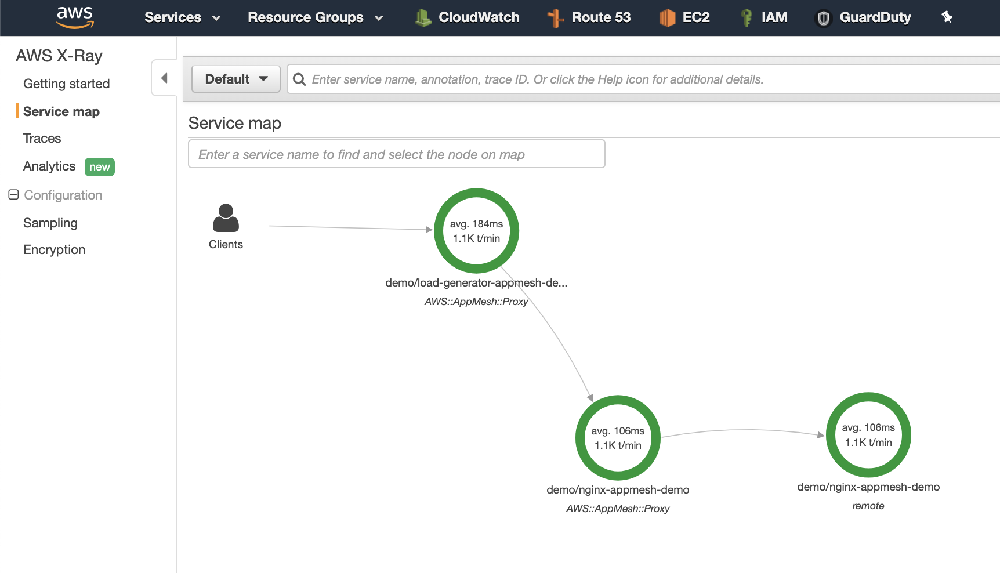
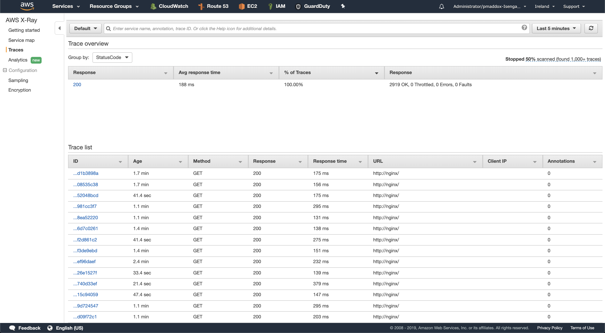
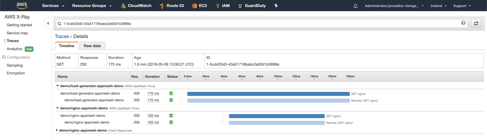

# Configuring AWS App Mesh and Kubernetes
- [Overview](#overview)
- [Deploy an EKS cluster](#deploy-an-eks-cluster)
- [Install Helm](#install-helm)
- [Install AWS App Mesh](#install-aws-app-mesh)
- [Deploy the demo application](#deploy-the-demo-application)
- [AWS X-Ray Integration](#aws-x-ray-integration)
- [Grafana / Prometheus Integration](#grafana--prometheus-integration)
- [Uninstall](#uninstall)

## Overview

This repository contains [helm](https://helm.sh) charts to make deploying AWS AppMesh to a Kubernetes cluster (for example, on [Amazon EKS](https://aws.amazon.com/eks/)) really easy. 

It will setup:

 - Automatic injection of the AWS App Mesh sidecar (envoy) (via [github.com/aws/aws-appmesh-inject](https://github.com/aws/aws-app-mesh-inject])) 
 - A Kubernetes controller that automatically managed AWS App Mesh resources ([github.com/aws/aws-app-mesh-controller-for-k8s](https://github.com/aws/aws-app-mesh-controller-for-k8s]))
 - Automatic injection of the AWS X-Ray sidecar
 - Preconfigured Prometheus and Grafana dashboards for AWS App Mesh ([github.com/PaulMaddox/aws-appmesh-grafana](https://github.com/PaulMaddox/aws-appmesh-grafana]))

## Deploy an EKS cluster

```bash
# install K8s CLI, Helm and eksctl
brew tap weaveworks/tap
brew install kubernetes-cli kubernetes-helm weaveworks/tap/eksctl

# deploy a K8s cluster (takes ~10min)
eksctl create cluster --appmesh-access
```

You can verify the cluster created successfully by running `kubectl get nodes`. You should see something similar to the output below:

```
NAME                                           STATUS   ROLES    AGE   VERSION
ip-192-168-10-51.eu-west-1.compute.internal    Ready    <none>   0d   v1.11.5
ip-192-168-14-229.eu-west-1.compute.internal   Ready    <none>   0d   v1.11.5
```

## Install Helm

```bash
# install helm cli
brew install kubernetes-helm

# setup k8s rbac for helm
kubectl apply -f https://raw.githubusercontent.com/PaulMaddox/aws-appmesh-helm/master/scripts/helm-rbac.yaml

# depoy helm into the cluster
helm init --service-account tiller
```

## Install AWS App Mesh

Deploy AWS App Mesh. This will deploy a mutating webhook admission controller to automatically inject all of your containers with an envoy sidecar, AWS X-Ray integration, and a StatsD exporter for prometheus metrics.

```bash
helm install -n aws-appmesh --namespace appmesh-system https://github.com/PaulMaddox/aws-appmesh-helm/releases/latest/download/aws-appmesh.tgz
```

Confirm the AWS App Mesh pods are up and running with `kubectl get pods -n appmesh-system`. The output should look similar to below:

```bash
NAME                                      READY   STATUS              RESTARTS   AGE
aws-appmesh-controller-7bcf7d87cf-7lgbq   1/1     Running             0          1m
aws-appmesh-grafana-5b87c9cf9-8m67p       1/1     Running             0          1m
aws-appmesh-inject-7786879564-472w2       1/1     Running             0          1m
aws-appmesh-prometheus-565c8bcb56-8ptz9   1/1     Running             0          1m
```

## Deploy the demo application

Deploy a demo application that consists of a service that generates HTTP load, and another service that recieves load (nginx). Neither of these applications have been instrumented in any way, but we will get rich metrics from AWS App Mesh/Envoy. 

```bash

# create a k8s namespace for the demo
kubectl create ns appmesh-demo

# enable auto-injection of AWS App Mesh sidecars for this namespace
kubectl label namespace appmesh-demo appmesh.k8s.aws/sidecarInjectorWebhook=enabled

# deploy the demo
helm install -n aws-appmesh-demo --namespace appmesh-demo https://github.com/PaulMaddox/aws-appmesh-helm/releases/latest/download/aws-appmesh-demo.tgz

```

Confirm the demo pods have been deployed with `kubectl get pods -n appmesh-demo`. The output should look similar to below:

```
NAME                             READY   STATUS    RESTARTS   AGE
load-generator-bb87d68fc-mr4vc   4/4     Running       1          19s
load-generator-bb87d68fc-rmzjc   4/4     Running       1          19s
load-generator-bb87d68fc-w6pkj   4/4     Running       1          19s
nginx-688dd6b89-2m99c            4/4     Running       0          19s
nginx-688dd6b89-ksdg6            4/4     Running       0          19s
```

You'll notice 4 containers for each pod. 

These are:

 - The application container (load-generator or nginx)
 - Envoy sidecar
 - AWS X-Ray daemon sidecar
 - StatsD Prometheus exporter

It's completely possible to disable AWS X-Ray, or the StatsD prometheus exporter if you do not need them. // TODO: provide details around overriding helm chart values for this.

## AWS X-Ray Integration

AWS App Mesh will automatically emit metrics to AWS X-Ray (via the auto-injected AWS X-Ray daemon sidecar):

```bash
open https://eu-west-1.console.aws.amazon.com/xray/home?region=eu-west-1#/service-map
```

From here you can explore your microservices within the AWS X-Ray console.






## Grafana / Prometheus Integration

Promtheus & Grafana dashboards have also automatically been configured.

```bash
kubectl -n appmesh-system port-forward svc/grafana 3000:3000
open http://localhost:3000
```

There are two preconfigured dashboards provided; one that provides a general overview of AWS App Mesh, and another that provides a per-service view. 


## Uninstall

```bash
helm del --purge aws-appmesh
helm del --purge aws-appmesh-demo
```